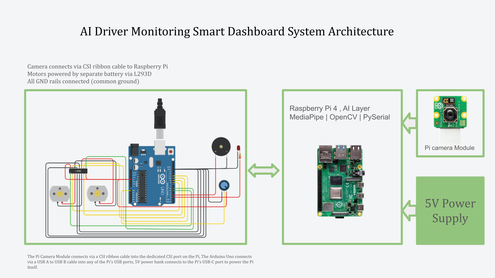
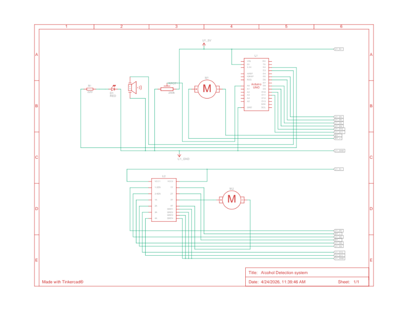

# Hardware
 
This folder contains all hardware documentation for the AI Driver Monitoring Smart Dashboard project, including circuit schematics, component references, system architecture, and the physical dashboard design.
 
---
 
## Contents
 
| File | Description |
|------|-------------|
| `system_architecture.png` | Full system architecture diagram showing all connections between Raspberry Pi, Arduino, sensors, and outputs |
| `tinkercad_schematic.png` | Circuit schematic screenshot exported from Tinkercad |
| `tinkercad_schematic.csv` | Tinkercad component list export |
| `components_list.md` | Full list of hardware components with specifications |
| `dashboard_3d_model` | 3D model of the physical driver monitoring dashboard enclosure |
 
---
 
## System Architecture
 

 
The system uses a distributed architecture with two processing units:
 
- **Raspberry Pi 4**: AI layer. Runs the MediaPipe face mesh model, calculates Eye Aspect Ratio, and sends serial commands to the Arduino
- **Arduino Uno**: Control layer. Reads sensors, controls motors via L293D, and manages alert outputs
The Pi and Arduino communicate over a single USB A to USB B cable, which handles both power delivery to the Arduino and bidirectional serial communication at 9600 baud.
 
---
 
## Connections Overview
 
### Raspberry Pi 4
| Connection | Type | Purpose |
|------------|------|---------|
| Pi Camera Module | CSI ribbon cable | Live video feed for drowsiness detection |
| Arduino Uno | USB A to USB B | Serial communication + power to Arduino |
| Power bank (5V) | USB-C | Powers the Raspberry Pi |
 
### Arduino Uno
| Component | Pin | Connection type |
|-----------|-----|----------------|
| L293D IN1 | D8 | Digital output: motor direction |
| L293D IN2 | D9 | Digital output: motor direction |
| L293D IN3 | D10 | Digital output: motor direction |
| L293D IN4 | D11 | Digital output: motor direction |
| L293D ENA | D5 | PWM: Motor A speed |
| L293D ENB | D6 | PWM: Motor B speed |
| Buzzer | D3 | Digital output: audible alert |
| LED | D2 | Digital output: visual alert (220Ω resistor) |
| MQ-3 sensor | A0 | Analog input: alcohol detection |
| MPU6050 SDA | A4 | I2C data: motion sensing |
| MPU6050 SCL | A5 | I2C clock: motion sensing |
| LCD SDA | A4 | I2C data: shared bus with MPU6050 |
| LCD SCL | A5 | I2C clock: shared bus with MPU6050 |
 
---
 
## Power Architecture
 
| Module | Power source | Voltage |
|--------|-------------|---------|
| Raspberry Pi | Dedicated 5V power bank | 5V via USB-C |
| Arduino | Powered by Pi via USB cable | 5V |
| Motors | Separate dedicated battery via L293D | 6–12V |
| Sensors & alerts | Arduino 5V rail | 5V |
 
**Critical:** All GND rails are connected together (common ground across all modules). Motors are never powered from the Arduino, they draw too much current and would damage it.
 
---
 
## Circuit Schematic
 

 
The circuit was designed and simulated in Tinkercad before physical assembly. The simulation confirmed:
- Motor forward/backward control via L293D
- Smooth gradual parking stop (left curve) on alcohol detection
- PWM speed control via ENA and ENB pins
- Alcohol sensor threshold detection via potentiometer simulation
- Buzzer and LED alert triggering
---
 
## Components List
 
| Component | Quantity | Specification | Role |
|-----------|----------|--------------|------|
| Raspberry Pi 4 | 1 | 4GB RAM recommended | AI processing |
| Arduino Uno | 1 | R3 | Hardware control |
| Pi Camera Module | 1 | v2 (8MP) or HQ | Face detection |
| MQ-3 Alcohol Sensor | 1 | Analog output | Breath alcohol detection |
| MPU6050 IMU | 1 | I2C, 3.3V/5V | Motion and tilt sensing |
| L293D Motor Driver | 1 | 600mA per channel | PWM motor control |
| DC Motors | 2 | 3–6V | Vehicle propulsion |
| LCD Display 16×2 | 1 | I2C module | Driver state display |
| Piezo Buzzer | 1 | Active or passive | Audible alert |
| LED | 1 | Any colour | Visual alert |
| Resistor | 1 | 220Ω | LED current limiting |
| Power bank | 1 | 5V, 2A minimum | Pi power supply |
| Motor battery | 1 | 6–12V | Motor power supply |
| USB A to USB B cable | 1 | Standard printer cable | Pi ↔ Arduino communication |
| CSI ribbon cable | 1 | Included with Pi Camera | Camera connection |
| Jumper wires | Several | Male to male, male to female | Component connections |
 
---
 
## I2C Bus Note
 
The MPU6050 and LCD display share the same I2C bus (pins A4 and A5 on the Arduino). This is intentional, I2C is a bus protocol that supports multiple devices on the same two wires. Each device has a unique address so the Arduino can address them independently without interference.
 
---
 
## Assembly Notes
 
- Always connect all GND rails before powering the system
- MQ-3 sensor requires 20–30 seconds warm-up time before readings are reliable, account for this in software
- L293D ENA and ENB pins come with jumper caps by default, remove these when connecting to Arduino PWM pins
- Never connect motors directly to Arduino, always use the L293D as an intermediary
- Test each module independently before connecting everything together
 
