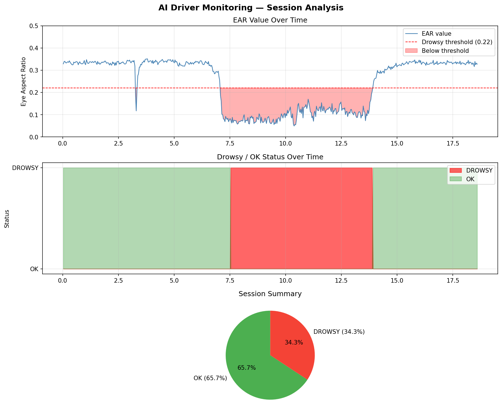

# AI Driver Monitoring Smart Dashboard
 
> A real-time embedded system that detects driver impairment through computer vision and multi-sensor fusion, executing adaptive safety interventions via distributed microcontroller architecture.
 
---
 
## Overview
 
Road accidents caused by driver drowsiness and alcohol impairment are a leading cause of fatalities globally. This project addresses that problem through an intelligent, low-cost embedded system that monitors driver state in real time and intervenes before an accident occurs.
 
The system uses a Raspberry Pi as the AI processing brain and an Arduino as the hardware control unit. They communicate over USB serial, dividing responsibilities: the Pi handles high-level perception, the Arduino handles real-time control. This distributed architecture ensures that hardware responses (motor stop, buzzer alert) remain fast and reliable even if the AI layer experiences delays.
 
---
 
## System Architecture
 
```
┌────────────────────────────────────────────────────┐
│                   INPUT LAYER                      │
│   Camera (Pi CSI)  │  MQ-3 Alcohol  │  MPU6050 IMU │
└──────────┬──────────────────┬────────────────┬─────┘
           │                  │                │
┌──────────▼──────────┐  ┌────▼────────────────▼─────┐
│   Raspberry Pi      │  │        Arduino Uno        │
│   (AI Layer)        │  │     (Control Layer)       │
│                     │  │                           │
│  - MediaPipe face   │  │  - MQ-3 analog read       │
│    mesh (468 pts)   │  │  - MPU6050 via I2C        │
│  - EAR calculation  │  │  - PWM motor control      │
│  - Drowsy decision  │  │  - Alert levels 1-3       │
│  - Serial TX        │  │  - Serial RX              │
└──────────┬──────────┘  └────────────┬──────────────┘
           │                          │
           └──────── USB Serial ──────┘
                    (9600 baud)
                          │
┌─────────────────────────▼───────────────────────────┐
│                  OUTPUT LAYER                       │
│   L293D Motor Driver  │  Buzzer  │  LED  │  LCD     │
└─────────────────────────────────────────────────────┘
```
 
---
 
## How It Works
 
### 1. Drowsiness Detection (Raspberry Pi)
 
The Pi captures video frames and passes each frame through MediaPipe's face mesh model, which identifies 468 facial landmarks. Six landmarks around each eye are used to calculate the **Eye Aspect Ratio (EAR)**:
 
```
EAR = (A + B) / (2 × C)
 
Where:
  A = vertical distance between landmarks 1 and 5
  B = vertical distance between landmarks 2 and 4
  C = horizontal distance between landmarks 0 and 3
```
 
When the eye is open, EAR ≈ 0.33. When closed, EAR drops below 0.22. If EAR stays below the threshold for 15 consecutive frames (~0.5 seconds), the system classifies the driver as drowsy and sends `DROWSY\n` to the Arduino over serial.
 
**Tested results from real video:**
 
| Frame | EAR   | Status |
|-------|-------|--------|
| 30    | 0.330 | OK     |
| 210   | 0.272 | OK (eyes beginning to close) |
| 240   | 0.075 | DROWSY |
| 270   | 0.067 | DROWSY |
| 420   | 0.320 | OK (eyes reopened) |
 
### 2. Alcohol Detection (Arduino)
 
The MQ-3 sensor outputs an analog voltage proportional to alcohol concentration in the air. The Arduino reads this on pin A0 (0–1023 range). Values above 600 trigger an immediate safety response, independent of the Raspberry Pi. This independence is a deliberate design decision — alcohol response works even if the Pi crashes.
 
### 3. Adaptive Intervention Levels
 
Rather than a binary stop/go response, the system implements three intervention levels:
 
| Level | Trigger | Response |
|-------|---------|----------|
| 1 | EAR dropping (warning zone) | LED flash, single buzzer beep |
| 2 | DROWSY signal from Pi | Gradual speed reduction (PWM ramp-down) |
| 3 | Alcohol detected OR prolonged drowsiness | Full motor stop, continuous alert |
 
### 4. Gradual Braking (PWM Ramp-Down)
 
Instant motor cutoff is unsafe in a real vehicle — it causes sudden deceleration. The system instead ramps PWM from 180 down to 0 in steps of 15, with 100ms between each step, producing a controlled stop over approximately 1.2 seconds.
 
```cpp
void gradualStop() {
  int speed = NORMAL_SPEED;
  while (speed > 0) {
    speed -= 15;
    if (speed < 0) speed = 0;
    analogWrite(ENA, speed);
    analogWrite(ENB, speed);
    delay(100);
  }
}
```
 
---
 
## Hardware Components
 
| Component | Role |
|-----------|------|
| Raspberry Pi 4 | AI processing, camera interface, serial TX |
| Arduino Uno | Sensor reading, motor control, serial RX |
| Pi Camera Module | Face and eye capture (CSI ribbon connection) |
| MQ-3 Alcohol Sensor | Breath alcohol detection (analog, pin A0) |
| MPU6050 IMU | Motion and tilt detection (I2C, pins A4/A5) |
| L293D Motor Driver | PWM motor control (IN1-4, ENA/ENB) |
| 2× DC Motors | Vehicle propulsion |
| LCD 16×2 (I2C) | Driver state display (shared I2C bus with MPU6050) |
| Buzzer | Audible alert (pin 3) |
| LED | Visual alert (pin 2, 220Ω resistor) |
 
**Power architecture:**
- Motors powered separately (dedicated battery via L293D) — never from Arduino
- Raspberry Pi powered from dedicated 5V power bank
- All GND rails connected (common ground across all modules)
---
 
## Software Stack
 
| Layer | Language | Libraries |
|-------|----------|-----------|
| Raspberry Pi | Python 3 | OpenCV, MediaPipe, PySerial, NumPy |
| Arduino | C++ (Arduino) | Wire.h, LiquidCrystal_I2C |
| Data logging | Python 3 | CSV, Matplotlib |
 
---
 
## Demo
 
The video below shows the drowsiness detection running on real test footage. EAR value and status are annotated on each frame in real time. Green overlay = alert, red overlay + border = DROWSY detected.
 
> drowsiness_output_h264.mp4
 
---
 
## Results & Evaluation
 
- EAR threshold of 0.22 correctly distinguished open eyes (≈0.33) from closed eyes (≈0.07) with no false positives during testing
- 15-frame window (~0.5 seconds) eliminated false triggers from normal blinking
- Gradual braking ramp produces a controlled stop over approximately 1.2 seconds
- Alcohol detection operates independently of the Pi — response latency under 50ms
---
 
## Limitations & Future Work
 
Honestly discussing limitations is part of rigorous engineering:
 
**Current limitations:**
- Camera performance degrades significantly in low light — an IR camera module would improve nighttime reliability
- MQ-3 requires 20–30 second warm-up before readings are reliable; system currently has no warm-up state
- EAR-based detection assumes a front-facing camera — head turned sideways breaks detection
- False positives possible if driver wears glasses with thick frames obscuring eye landmarks
- No real-world vehicle dynamics modelled — braking behaviour on actual road surface untested
**Planned improvements:**
- PERCLOS metric (percentage of eye closure over time) for more robust drowsiness classification
- Data logging and pattern analysis across multiple driving sessions
- Multi-factor risk scoring combining EAR + alcohol value + MPU6050 erratic motion into a single impairment score
- GPS integration for guardian alerts in Level 3 intervention
---
 
## Project Background
 
Built as part of an independent engineering portfolio while studying A-Level Mathematics in Zambia. The project explores the intersection of embedded systems, computer vision, and road safety — motivated by the real-world relevance of driver impairment detection in developing road infrastructure contexts.
 
---

## Results


 
## Author
 
**Jonas Mukendenge**  
A-Level Student | Aspiring Mechatronics / Electrical Engineer  
Zambia
 
